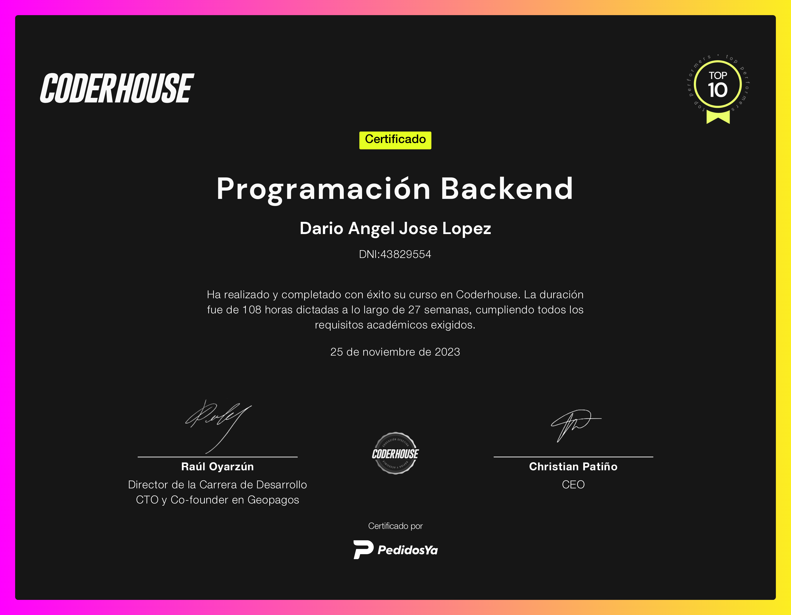

# Ecommerce Back End Coder House 2023 🌍

Proyecto Final CoderHouse 2023. Ecommerce STACK MERN -> Mongo, Express, React, Node.

 
    

         
     

#     

    

# Deployment de la aplicación 

* https://ecommercebackend2023coderhouse-production-4c91.up.railway.app/

# Acerca de como ejecutar la aplicación: 

* Clonar el repositorio
* Solicitar las credenciales (archivo .env) y colocarlo en el directorio principal
* Instalar las dependencias con el comando-> npm i
* Para correr la aplicación en producción hacer uso del comando-> npm start
* Para correr la aplicación en desarrollo hacer uso del comando-> npm run dev
* Para correr los test tener el servidor apagado,ya que supertest lo enciende
* Para correr los test de Session hacer uso del comando-> npm run testSession
* Para correr los test de Products hacer uso del comando-> npm run testProducts
* Para correr los test de Carts hacer uso del comando-> npm run testCarts

# Información sobre la aplicación 📜:

* El proyecto se trata de una eccomerce para la venta de productos (de cualquier rubro)
* En este caso he optado por cargar productos referidos al mundo del Hardware y la tecnología

# Arquitectura de la aplicación: 

* Se usa el Modelo Vista Controlador
* Arquitectura de 3 capas con Controllers, Services Repositorys
* Se utiliza el patrón DAO (data access object) para diferentes métodos de persistencia
* Se utiliza el patrón DTO para evitar el envío de información sensible
* Se utiliza el patrón Factory.
* Se utiliza un módulo para el manejo de errores personalizado.
* Se utilizan Loggers

# APIs implementadas 📞:
* API para el manejo de los productos (con websockets)
* API Para el manejo de las categorías
* API para el manejo de los usuarios (Administrador,Usuario,Premium)
* API para la manejo de la autenticacion (login-github, login-google, uso de JWT)
* API para carrito de compras
* API para un chat de soporte (con websockets)
* API para los tickets de una compra 
* Reestablecimiento de la contraseña del usuario
* Verificación del correo del usuario a través de un mail con nodemailer
* API para subir archivos foto de perfil - imagen del producto - documentos del usuario (con multer)
* API para la pasarela de pago con stripe

# Datos de interés 🏹: 
* Persistido en una base de datos no relacional (Mongo DB)
* Interfaz Gráfica de usuario con estilos en HTML, CSS, JS, Boostrap
* Validaciones de formulario.
* Documentación con Swagger

# Testing
* Los testing se realizan para el módulo de productos, del carrito y de las sessiones.
* Mocha
* Chai
* Super-Test

# Datos del cursado 📚:
- **Año: 2023**
- **Comisión: 52135**
- **Del 20-05-2023 al 11-11-2023**
- **Profesor: Arturo Verbel de Leon**
- **Tutor: Alan Alexis Galvan.**

# Tecnologías utilizadas 💻: 
* 
* 
* 
* 
* 
* 
* 
* 
* 
* 
* 
* 

(<a href="#top">Volver Arriba</a>)

